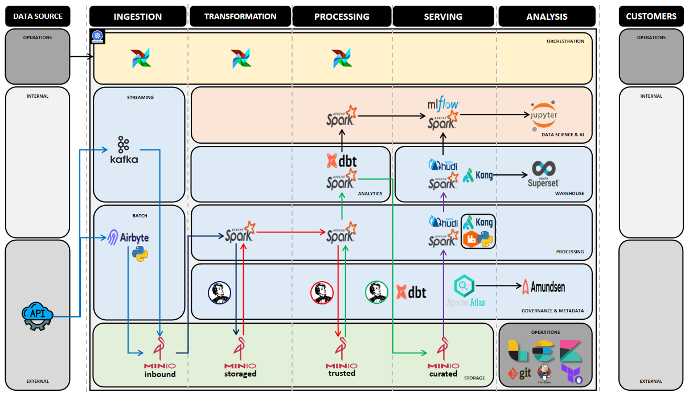

# EXERCISE 3: SOLUTION PROPOSAL

This document outlines a scalable and reliable data pipeline design for integrating data from multiple third-party REST APIs. The pipeline is designed to ingest, transform, and serve data efficiently while meeting the requirements for error handling, monitoring, and scalability.

## Architecture Overview

The proposed architecture consists of three main layers with additional components to ensure scalability, reliability, and monitoring. The image below shows a high-level diagram of the architecture:

This is an on-premises architecture solution based on Kubernetes cluster. Also it is based an open-source technologies. However, cloud services alternative will be provided.

## Detailed Architecture

### Data Ingestion Layer

The Data Ingestion Layer is responsible for extracting and validating data from multiple third-party REST APIs and storing it in a raw format.

Components:
- **API Connectors**: Custom connectors for each third-party API, handling authentication and data extraction.
- **Data Collector Service**: Orchestrates the data collection process, managing API rate limits and scheduling.
- **Message Queue**: Buffers incoming data to handle high volumes, streaming data flows, and ensure fault tolerance.
- **Raw Data Storage**: A distributed object storage system for storing raw API responses.
- **Data Processing Engine**: Distributed computing framework for large-scale data processing.
- **Data Quality Service**: Validates and cleanses data according to predefined rules.

Technology choices:
- **Airbyte** and **Python custom applications** as API connectors solution. Cloud alternatives are AWS DataPipelines, Azure Data Factory and Google Composer/Dataprep.
- **Apache Airflow** for orchestration. It provides many connectors and can replace Airbyte. Cloud alternatives are AWS Step Functions, Azure DataFactory, Google Composer.
- **Apache Kafka** for message queuing. Cloud alternatives are AWS Kinesis, Azure Service Bus, and Google PubSub.
- **MinIO** for raw data storage. Cloud alternatives are AWS S3, Azure ADLS, or Google Cloud Storage.
- **Apache Spark** for data processing in the data validation. Cloud alternatives are AWS Glue, Azure Synapse, or Google Dataproc.
- **Great Expectations** for data valitation between the inbound (temporary) to storage layer.

Justification:
- **Airbyte** provides many built-in connectors and **Python custom** solution can be developed to integrate with new APIs.
- **Apache Airflow** provides flexible scheduling, monitoring, retring and tracing capabilities.
- **Apache Kafka** ensures high throughput, streaming and fault tolerance for incoming data streams.
- **MinIO** is an object storage that offers scalability and cost-effectiveness for raw data storage.
- **Apache Spark** offers powerful distributed processing capabilities for large datasets.
- **Great Expectations** provides a robust framework for data validation and quality assurance.

### Data Transformation Layer

The Data Transformation Layer cleanses, transforms, and aggregates the raw data into a consistent and structured format.

Components:
- **Data Processing Engine**: Distributed computing framework for large-scale data processing.
- **Data Quality Service**: Validates and cleanses data according to predefined rules.
- **Data Transformation Service**: Applies business logic and transformations to the data.
- **Transformed Data Storage**: A data warehouse for storing processed and structured data.

Technology choices:
- **MinIO** for transformed data storage. 
- **Apache Spark** for data processing.
- **Great Expectations** for data quality checks in the lake operations
- **Data Build Tool** with **Apache Spark connector** as a data warehousing framework that provide data quality, standarization, governance, and business-oriented data transformations based on SQL.

Justification:
- **MinIO** is an object storage that offers scalability and cost-effectiveness for transformed data storage.
- **Apache Spark** offers powerful distributed processing capabilities for large datasets.
- **Great Expectations** provides a robust framework for data validation and quality assurance.
- **Data Build Tool** with **Apache Spark connector** to provide data warehousing transformations and help to integrate the product and business teams to apply the business logic/rules in the transformed/trusted data layer.

### Data Serving Layer

The Data Serving Layer stores the transformed data in a queryable format for data analysts and data scientists to access and analyze using SQL queries.

Components:
- **Query Engine**: Processes and optimizes SQL queries on the transformed data.
- **API Gateway**: Provides secure access to the data through RESTful APIs.
- **Distributed Computing**: Provide scalable and reliable computing to applications.
- **Caching Layer**: Improves query performance for frequently accessed data.

Technology choices:
- **MinIO** (**Amazon S3** or **Google Cloud Storage**) for structured data object storage.
- **Apache Hudi on top of the Apache Spark SQL** for SQL query processing. Cloud alternatives are AWS Athena/Glue or Redshift Spectrum, Azure Synapse Analytics or Databricks, or Google Big Query.
- **Kong** for API management. Cloud alternatives are AWS API Gateway, Azure API Management, or Google API Gateway.
- **Ray with Python runtime** to support a distributed application. Cloud alternatives are AWS Lambda, Azure Functions and Google Functions.
- **RabitMQ** provides intercommunication in a distributed application. Cloud alternatives are AWS SNS/SQS or Event Bridge, Azure EventGrid ou EventHub, or Google PubSub.
- **Redis** for caching. Cloud alternatives are AWS ElatiCache, Azure Cache, and Google Memorystore.

Justification:
- **MinIO** is an object storage that offers scalability and cost-effectiveness for structured data storage.
- **Apache Hudi** is distributed SQL engines that allows fast and scalable querying across large datasets. **Apache Hudi** offers scalability, performance, and built-in features for analytics. It works an a lakehouse approach on top of the **Apache Spark** by performing read/write operations direct on the structured data objects.
- **Kong** as an API Gateways provides security, rate limiting, and monitoring for data access.
- **Python runtime** based on distribuited computing frameworks like **Ray** to support microservices.
- **RabbitMQ** is a message solution to allow the microservices to communicate among them.
- **Redis** is an in-memory caching improves response times for common queries.

## Other Concerns

### Error Handling and Retry Mechanisms

To ensure data integrity and pipeline continuity:
- Implement circuit breakers for API calls to prevent cascading failures.
- Implement dead-letter queues for messages that fail processing after multiple retries.
- Log all errors with context for debugging and analysis.

### Monitoring and Alerting

For comprehensive pipeline observability:
- Implement a centralized logging system (ELK stack) for log aggregation and analysis.
- Implement health checks for all services and components.
- Set up metrics collection for system and business KPIs.
- Configure alerts for anomalies, errors, and SLA breaches.

### Scalability

To handle increasing data volumes and traffic demands:

- Use containerization (Docker) and orchestration (Kubernetes) for easy scaling of services.
- Implement auto-scaling policies based on CPU, memory usage, and queue length.
- Use replicating, partitioning and sharding strategies in data storage systems.
